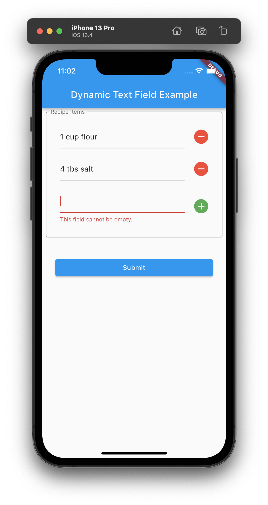

# flutter_dynamic_text_field

Sample app illustrating how to create a dynamic set of text fields as part of a form.

You can add and delete text fields dynamically as part of filling out the form. 

The example includes a validator to check that all fields have values upon pressing the submit button.

Here's an example screenshot showing the display after two items have been entered and an attempt is made to submit the form with an empty text field.

